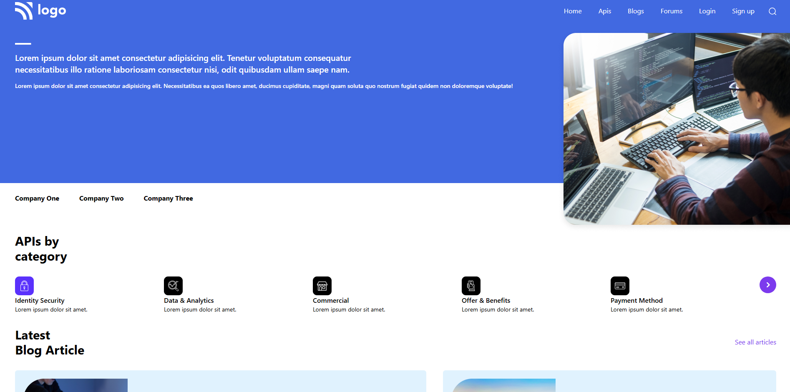
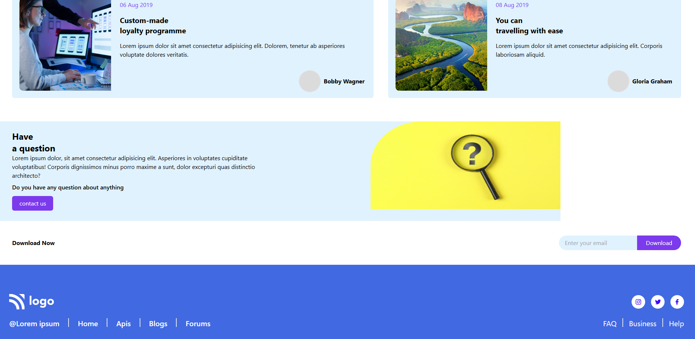

# 🚀 web developer page

A modern, responsive **API Landing Page UI** built using **HTML + Tailwind CSS**.
Designed with a clean layout, smooth responsiveness, and modern UI/UX principles.

---

## 📌 Overview

This project is a fully responsive landing page that showcases:

* API categories
* Blog articles
* Company partnerships
* Call-to-action sections

It is optimized for **mobile, tablet, and desktop screens**.

---

## ✨ Features

* 📱 Fully responsive design (Mobile → Desktop)
* 🎨 Modern UI with Tailwind CSS
* ⚡ Fast and lightweight (No frameworks)
* 🧩 Reusable components
* 🎯 Clean typography using Google Fonts
* 🖱️ Hover effects & micro-interactions
* 📦 Organized layout sections

---




## 🛠️ Tech Stack

* **HTML5**
* **Tailwind CSS (CDN)**
* **Font Awesome Icons**
* **Google Fonts**

  * Poppins
  * Inter
  * Montserrat
  * Michroma

---

## 📂 Project Structure

```
📁 project-folder
│── index.html
│── 📁 img
│   ├── Logo.png
│   ├── Group 97.png
│   ├── Group 98.png
│   ├── ...
```

---

## 📸 Sections Included

* ✅ Navbar (Responsive with hamburger menu)
* ✅ Hero Section
* ✅ Company Logos Section
* ✅ API Categories
* ✅ Blog Articles
* ✅ CTA (Have a Question)
* ✅ Email Subscription
* ✅ Footer

---

## 🎯 Key UI Highlights

* Clean spacing and alignment
* Consistent color palette (#4169E1, violet, sky)
* Smooth hover animations
* Readable typography hierarchy
* Card-based layout for blogs

---

## 🚀 How to Run

1. Download or clone the project
2. Open `index.html` in your browser

```bash
git clone https://github.com/your-username/api-landing-page.git
```

---

## 🔥 Future Improvements

* Add mobile menu toggle (JavaScript)
* Add animations (Framer Motion / AOS)
* Convert to React / Next.js
* Backend integration for email subscription
* Dark mode support

---

## 👨‍💻 Author

**ABHINAV ABIN**

* UI/UX Enthusiast
* MERN Stack Learner

---

## 📄 License

This project is open-source and free to use.

---

## 💡 Inspiration

Inspired by modern SaaS and API marketplace landing pages.


